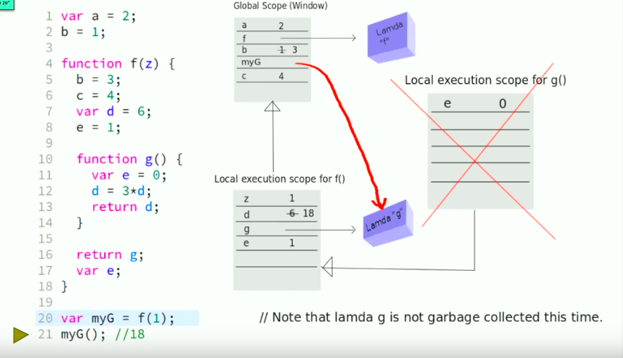
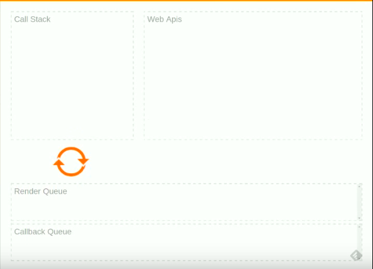

# ScopeChains

<figcaption>第一题</figcaption>

图片描述的是 myG()执行后，执行环境中还保留的作用域链。因为闭包的缘故，只有 g()的作用域被回收了。

当时看到结果时，对 g()的作用域被回收这个现象还是有疑惑的。因为，我心中的闭包是函数和其绑定的周边状态（词法环境）的组合。而对“周边状态”的范围，我没有清楚的界限。我认为 g 函数中的变量 e 会被保留。

后来改了一下代码：
```JavaScript
function g() {
	var e = 0;
	e++;
	return e;
}
```
运行了下代码，发现 e 的值并不会像 d 一样会叠加。这才发现自己错了。

事后，又想了想，认为 g 的作用域肯定是要被回收的。毕竟有没有人引用它的作用域。

---

# EventLoop
对事件循环的讲解，我并没有疑问。只是第一次看到有人把 Js 执行流程用动画表现出来，感觉很赏心悦目。


<figcaption>EventLoop</figcaption>

---

# Vedio

<iframe width="560" height="315" src="https://www.youtube.com/embed/QyUFheng6J0" frameborder="0" allowfullscreen></iframe>
