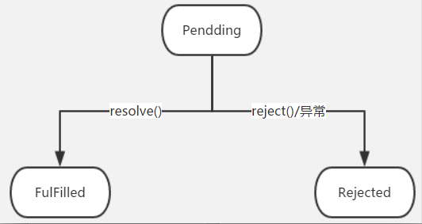

# 前言
在 JavaScript 的世界中，所有代码都是单线程执行的。

由于这个“缺陷”，导致 JavaScript 的所有网络操作，浏览器事件，都必须是异步执行。异步执行可以用回调函数来实现。常见的例子如 AJAX，就是典型的异步操作：

```javascript
request.onreadystatechange = function () {
    if (request.readyState === 4) {
        if (request.status === 200) {
            return success(request.responseText);
        } else {
            return fail(request.status);
        }
    }
}
```

把回调函数 success(request.responseText)和 fail(request.status)写到一个 AJAX 操作里很正常，但是不好看，而且不利于代码复用。所以，为了使代码更优雅。出现了这样的写法：

```javascript
var ajax = ajaxGet('http://...');
    ajax.ifSuccess(success)
        .ifFail(fail);
```

这种链式写法的好处，不单单是优雅。它使得执行代码和处理结果的代码清晰的分离了。


# Promise基础介绍

Promise 是异步编程的一种解决方案，比传统的解决方案——回调函数和事件——更合理和更强大。

## 常见用法

```javascript
var promise = new Promise(function(resolve, reject) {
    // ... some code
    if ( /* 异步操作成功 */ ) {
        resolve(value);
    } else {
        reject(error);
    }
});

promise.then(function(value) {
    // success
}, function(error) {
    // failure
});
```

再来张图：

<figcaption>promise介绍</figcaption>

看图说话：
1. Promise 构造方法接受一个方法作为参数，该方法传入两个参数，resolve 和 reject。这两个参数都是函数。
2. resolve 用来将 Promise 对象的状态置为成功，并将异步操作结果 value 作为参数传给成功回调函数。
3. reject 用来将 Promise 对象的状态置为失败，并将异步操作错误 error 作为参数传给失败回调函数。
4. then 方法绑定两个回调函数，第一个用来处理 Promise 成功状态，第二个用来处理 Promise 失败状态。


## Promise状态
因为 Promise 是用来异步操作的，所以它他有三种状态：
- Pending（执行中）
- Fulfilled (已完成)
- Rejectd（失败）。
后两者对应着处理结果。

状态间的具体关系：

<figcaption>promise状态</figcaption>


如上图所示，Promise 对象有两个特点：
1. 对象状态只由异步操作结果决定。resolve 方法会使 Promise 对象由 pendding 状态变为 fulfilled 状态；reject 方法或者异常会使得 Promise 对象由 pendding 状态变为 rejected 状态。Promise 状态变化只有上图这两条路径。

2. 对象状态一旦改变，任何时候都能得到这个结果。即状态一旦进入 fulfilled 或者 rejected，promise 便不再出现状态变化，同时我们再添加回调会立即得到结果。这点跟事件不一样，事件是发生后再绑定监听，就监听不到了。

# 串行执行
通常要串行执行异步任务们，不用 Promise 需要写一层一层的嵌套代码。有了 Promise，我们只需要简单地写：
```JavaScript
job1.then(job2).then(job3).catch(handleError);
```
可以这样写的原因是 then 返回的是 promise 的实例。这种写法也叫级联。

一个详细的例子：
```JavaScript
function log(s) {
    console.log(s);
}

// 0.5秒后返回input*input的计算结果:
function multiply(input) {
    return new Promise(function (resolve, reject) {
        log('calculating ' + input + ' x ' + input + '...');
        setTimeout(resolve, 500, input * input);
    });
}

// 0.5秒后返回input+input的计算结果:
function add(input) {
    return new Promise(function (resolve, reject) {
        log('calculating ' + input + ' + ' + input + '...');
        setTimeout(resolve, 500, input + input);
    });
}

var p = new Promise(function (resolve, reject) {
    log('start new Promise...');
    resolve(123);
});

p.then(multiply)
 .then(add)
 .then(function (result) {
    log('Got value: ' + result);
});
```

# 并行执行
除了串行执行若干异步任务外，Promise 还可以并行执行异步任务。

试想一个页面聊天系统，我们需要从两个不同的 URL 分别获得用户的个人信息和好友列表，这两个任务是可以并行执行的，用 Promise.all()实现如下：
```JavaScript
var p1 = new Promise(function (resolve, reject) {
    setTimeout(resolve, 500, 'P1');
});
var p2 = new Promise(function (resolve, reject) {
    setTimeout(resolve, 600, 'P2');
});
// 同时执行p1和p2，并在它们都完成后执行then:
Promise.all([p1, p2]).then(function (results) {
    console.log(results); // 获得一个Array: ['P1', 'P2']
});
```
那 all()的具体实现是怎样的呢？
```javascript
function all(promises) {
  return new Promise(function(succeed, fail) {
    var results = [], pending = promises.length;
    promises.forEach(function(promise, i) {
      promise.then(function(result) {
        results[i] = result;
        pending -= 1;
        if (pending == 0)
          succeed(results);
      }, function(error) {
        fail(error);
      });
    });
    if (promises.length == 0)
      succeed(results);
  });
}
```
参考链接：
- [Promise](https://www.liaoxuefeng.com/wiki/001434446689867b27157e896e74d51a89c25cc8b43bdb3000/0014345008539155e93fc16046d4bb7854943814c4f9dc2000)
