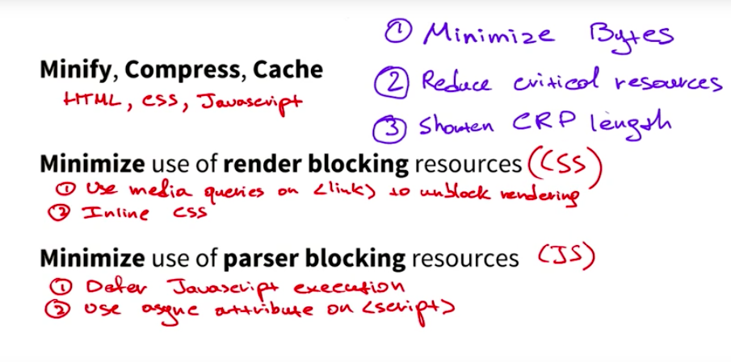

# 序

首先你在浏览器里输入网址，然后按下 Enter 键，之后浏览器就会开始查找 IP。它会先从浏览器的缓存里寻找相应的 IP。如果找不到，它会依次从系统缓存，路由器缓存，ISP DNS 缓存中寻找 IP。如果还是找不到的话，那只能从根域名开始，递归的往下搜索，比如从.com 到 Facebook.com。找到 IP 后，就会向服务器发起 HTTP 请求，然后服务器处理请求，可能返回一个 HTML 响应。一直到这一步，只能算是问题的一部分。为什么这么说呢？　你完全可以把上面的文字添加到“输入 url 到加载完页面发生了什么”后面，组成一个简单很多的问题。文章接下来的部分，就是在回答这个更简单的问题。现在的我还不能面面俱到，只能选熟悉的地方回答。


# 关键渲染路径
浏览器接收到服务器返回的 HTML、CSS 和 JavaScript 字节数据并对其进行解析和转变成像素的渲染过程被称为关键渲染路径。通过优化关键渲染路径即可以缩短浏览器渲染页面的时间。优化关键渲染路径是指优先显示与当前用户操作有关的内容。

浏览器在渲染页面时，需要知道页面结构和样式。所以，浏览器会先构建 DOM 树和 CSSOM 树，像是画蓝图一样。

DOM 树全称为 Document Object Model 文档对象模型，它是 HTML 和 XML 文档的编程接口，提供了对文档的结构化表示，并定义了一种可以使程序对该结构进行访问的方式（比如 JavaScript 就是通过 DOM 来操作结构、样式和内容）。DOM 将文档解析为一个由节点和对象组成的集合，可以说一个 Web 页面其实就是一个 DOM。

CSSOM 树全称为 Cascading Style Sheets Object Model 层叠样式表对象模型，它与 DOM 树的含义相差不大，只不过它是 CSS 的对象集合。

## 构建DOM
浏览器获得 HTML 文件后会经过一个流程将数据解析为 DOM 树：

<figcaption>字节 → 字符 → 令牌 → 节点 → 对象模型</figcaption>


1. 转换： 浏览器从磁盘或网络读取 HTML 的原始字节，并根据文件的指定编码（例如 UTF-8）将它们转换成各个字符。

2. 令牌化： 浏览器将字符串转换成 W3C HTML5 标准规定的各种令牌，例如，“<html>”、“<body>”，以及其他尖括号内的字符串。每个令牌都具有特殊含义和一组规则。
3. 词法分析： 发出的令牌转换成定义其属性和规则的“对象”。
4. DOM 构建： 最后，由于 HTML 标记定义不同标记之间的关系（一些标记包含在其他标记内），创建的对象链接在一个树数据结构内，此结构也会捕获原始标记中定义的父项-子项关系：HTML 对象是 body 对象的父项，body 是 paragraph 对象的父项，依此类推。

整个流程的最终输出是我们这个简单页面的文档对象模型 (DOM)，浏览器对页面进行的所有进一步处理都会用到它。

## 构建CSSOM

在浏览器构建 DOM 时，在文档的 head 部分遇到了一个 link 标记，该标记引用一个外部 CSS 样式表：style.css。由于预见到需要利用该资源来渲染页面，它会立即发出对该资源的请求，并得到以下内容：
```CSS
body { font-size: 16px }
p { font-weight: bold }
span { color: red }
p span { display: none }
img { float: right }
```
与构建 DOM 时候一样，会依次产生字节，字符，令牌，节点，css 对象模型：


将 cssom 和 dom 比较，你会发现 cssom 是基于 dom 构建的。实际情况下，浏览器将不会渲染任何已处理的内容，直至 CSSOM 构建完毕,所以说 css 被视为阻塞渲染的资源。

> [浏览器为什么要从右向左匹配 CSS 选择器](https://segmentfault.com/q/1010000000713509)

## 构建渲染树
在构建了 DOM 树和 CSSOM 树之后，浏览器只是拥有了两个互相独立的对象集合，DOM 树描述了文档的结构与内容，CSSOM 树则描述了对文档应用的样式规则，想要渲染出页面，就需要将 DOM 树与 CSSOM 树结合在一起，这就是渲染树。


为构建渲染树，浏览器大体上完成了下列工作：

1. 从 DOM 树的根节点开始遍历每个可见节点。
    - 某些节点不可见（例如脚本标记、元标记等），因为它们不会体现在渲染输出中，所以会被忽略。
    - 某些节点通过 CSS 隐藏，因此在渲染树中也会被忽略，例如，上例中的 span 节点不会出现在渲染树中，因为有一个显式规则在该节点上设置了“display: none”属性。

2. 对于每个可见节点，为其找到适配的 CSSOM 规则并应用它们。
3. 发射可见节点，连同其内容和计算的样式。

渲染树构建完毕后，浏览器得到了每个可见节点的内容与其样式，下一步工作则需要计算每个节点在窗口内的确切位置与大小，也就是布局阶段。

## 布局

布局阶段会从渲染树的根节点开始遍历，然后确定每个节点对象在页面上的确切大小与位置。布局阶段的输出是一个盒子模型，它会精确地捕获每个元素在屏幕内的确切位置与大小，所有相对的测量值也都会被转换为屏幕内的绝对像素值。

最后，既然我们知道了哪些节点可见、它们的计算样式以及几何信息，我们终于可以将这些信息传递给最后一个阶段：将渲染树中的每个节点转换成屏幕上的实际像素。这一步通常称为“绘制”或“栅格化”。

## 总结
下面简要概述了浏览器完成的步骤：
1. 处理 HTML 标记并构建 DOM 树。
2. 处理 CSS 标记并构建 CSSOM 树。
3. 将 DOM 与 CSSOM 合并成一个渲染树。
4. 根据渲染树来布局，以计算每个节点的几何信息。
5. 将各个节点绘制到屏幕上。

优化关键渲染路径_就是指最大限度缩短执行上述第 1 步至第 5 步耗费的总时间。具体怎么优化，请看下一节。

以上就是浏览器从获得文件，到初次加载页面的全部信息。

# 优化
通过一张图来说优化方法。



### Minify,Compress, Cache
**Minify**指的是资源最小化，具体包含预处理和环境特定优化两部分。

在计算机科学中，预处理器是程序中处理输入数据，产生能用来输入到其他程序的数据的程序。 输出被称为输入数据预处理过的形式，常用在之后的程序比如编译器中。在网站中的表现形式要差不多。网页中的 html，css 和 JavaScript 等根据不同的规则构成有效的内容元素。例如：
- 代码注释是开发者最好的朋友，但浏览器不需要看到它们！　直接删除 CSS (/* … */)、HTML (<!-- … -->) 和 JavaScript (// …) 注释可显著减小网页的总大小。

- “智能”CSS 压缩程序会注意到采用低效率的方式为“.awesome-container”定义规则，它会将两个声明折叠为一个而不影响任何其他样式，从而节省更多字节。
- 空白（空格和制表符）能够在 HTML、CSS 和 JavaScript 中给开发者提供方便。可以增加一个压缩程序来去掉所有制表符和空格。

另外还会根据特定的场合进行优化。简单的说就是只给用户需要的。

**Compress**是指压缩文本，如通过 gzip。GZIP 是一种可以作用于任何字节流的通用压缩程序。它会在后台记忆一些之前看到的内容，并尝试以高效方式查找并替换重复的数据片段

**Cache**指的是 Http 缓存。

### Minimize use of render blocking resource
意思应该很明确。通过 media query 来按需加载和內联 css 来减少资源。

### Minimize use of parser blocking resource


有关 script,script defer 和 script async 的不同，可以看下图：


