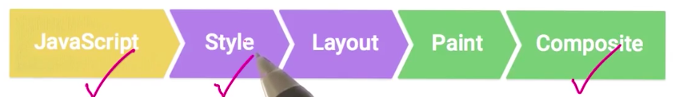

# 盒模型
我们都知道文档中的每一个元素都是一个矩形盒子。如果有人不信的话，只要打开一下 Developers Tool，再去选中一个元素，就会发现一块蓝色的矩形。因此，渲染引擎的目标就是确定这些盒子的尺寸和属性。

在 CSS 中，我们使用盒模型描述这些盒子。在盒模型的定义中，每个盒子有四条边：border edge, padding edge
,margin edge 和 content edge。直观的表示，如图：

<figcaption>盒模型</figcaption>

#### 一些要点:
如果你使用 box-sizing: border-box ，那么只有 width, min-width, max-width, height, min-height 与 max-height 这些属性能控制内容大小。

内边距区域 padding area 延伸到包围 padding 的边框。如果内容区域 content area 设置了背景、颜色或者图片，这些样式将会延伸到 padding 上(译者注：而不仅仅是作用于内容区域)。它位于内边距边界内部, 它的大小为 padding-box  宽与 padding-box 高。

在外边距合并的情况下，由于盒之间共享外边距，外边距不容易弄清楚。你可以使用 flex 来防止这种情况。

参考链接：
- [盒子模型](https://developer.mozilla.org/zh-CN/docs/Web/CSS/CSS_Box_Model/Introduction_to_the_CSS_box_model)

---

# Flexbox
新东西的出现，肯定有他的原因。我认为 Flexbox 的出现是为了解决如何适应不同屏幕尺寸的问题。

就从 flex 这个属性开始讲。flex 属性其实是 flex-grow，flex-shrink 和 flex-basis 的简写。flex-grow 是来定义项目放大的比例的，与之相对的 flex-shrink 则是定义项目缩小的比例的。这两个属性使得元素具有填充可用空间和收缩来避免溢出的特性。我认为之所以取名为弹性盒子，就是为了强调这一新的布局模式有强大的灵活性,如能自动调整大小，拉伸，收缩和移动。而 flex-grow 和 flex-shrink 是很好的体现，它们俩使你可以控制布局的伸缩性。其他的属性如 order，flex-direction，justify-content，align-items 和 align-self 等等，都是为了让你写出能在不同屏幕尺寸上灵活适应的布局。

学习 felxbox，结合下面这张图看各个属性的定义，能更好的理解。具体的学习资料可以看参考链接给出的**Flex 布局教程：语法篇**。

<figcaption>FLexbox</figcaption>

了解来 Flexbox 的属性之后，不找点东西练练手，就不会清楚自己掌握了多少。你可以去下面的参考链接上找实例，也可以看一下我写的一些实例：[flex-practice](https://github.com/FourEyebrowXiake/Eloquent-JavaScript-Exercise/tree/master/flex-practice)

- 参考链接
	- [使用弹性盒子](https://developer.mozilla.org/zh-CN/docs/Web/CSS/CSS_Flexible_Box_Layout/Using_CSS_flexible_boxes)
	- [Flex 布局教程：语法篇](http://www.ruanyifeng.com/blog/2015/07/flex-grammar.html)
	- [The Ultimate Guide to Flexbox — Learning Through Examples](https://medium.freecodecamp.org/the-ultimate-guide-to-flexbox-learning-through-examples-8c90248d4676)

---

# 如何写出更好的css
CSS module 的出现使你能够更容易地组织 css 代码。每个组件的 CSS 被写到响应的文件中，彼此直接又不受影响，真是不要太好。

还有其他的，如层级不宜过深，如何时用 ID 和何时用 class 和更具需求写 reset 等等。再深入点，涉及到页面重新绘制的管道：

<figcaption>pipe</figcaption>

当要改变 css 的属性时，尽量采用对管道影响最少的属性。可以访问[csstriggers.com](https://csstriggers.com/)了解详情。

说了这么多，我认为最重要的还是先写好标签，再来动你的样式文件。毕竟房子的结构不设置好，装修起来就很费劲。同样的，不先写好布局，在写其他的属性的话，会很乱。

具体地说，当我准备开工的时候，在我创建一个 CSS 文件之前，我检查并对整个文档进行编码(HTML)，从开始 body 标签到结束整个 body 标签。不添加任何多余的 div、id 或 class。我会添加一些通用的 div，比如头部，内容，底部，因为我知道这些东西肯定会有。

使用 CSS 的向后选择器来定义子元素。不要直接自动的为元素添加类或 id。请记住，如果一个文档没有良好的格式(结构)，CSS 是毫无价值的。

参考链接：
- [快速写出较好CSS的5种方法](https://www.qianduan.net/the-fast-write-better-css-of-five-kinds-of-methods/)
